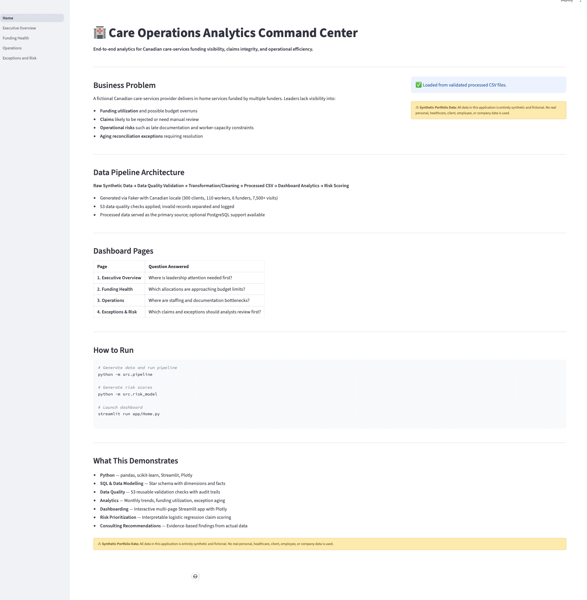
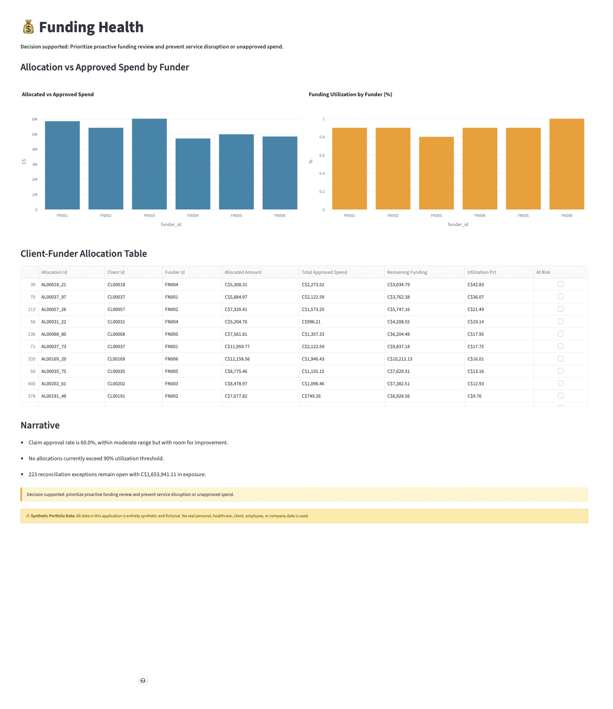
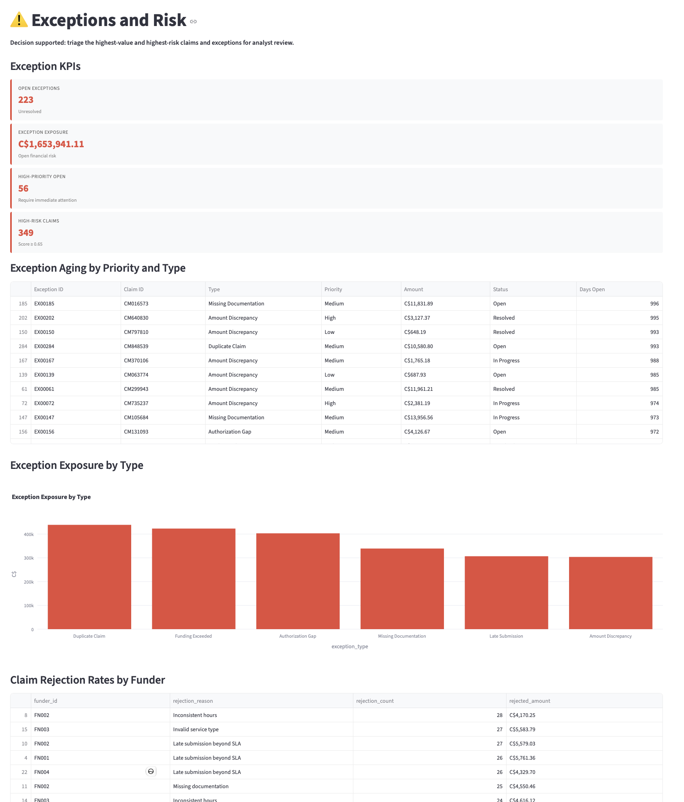

# Care Operations Analytics Command Center

**An analytics project for a fictional Canadian care-services provider. It reports funding use, flags claims that may need manual review, and surfaces operational problems like late documentation and aging exceptions.**

> **All records are fictional and generated solely for portfolio demonstration. No real personal, healthcare, client, employee, or company data is used.**

---

## Screenshots

The following screenshots show the working local Streamlit dashboard:







---

## Business Problem

A fictional Canadian care-services provider delivers in-home services funded by multiple funders. Leaders lacked visibility into:

- **Funding utilization** and possible budget overruns
- **Claims** likely to be rejected or need manual review
- **Operational risks** such as late documentation and worker-capacity constraints
- **Aging reconciliation exceptions** requiring resolution

---

## Key Capabilities

- Synthetic-data generation with Canadian locale
- Data-quality validation with 53 checks and audit logging
- Python ETL/transformation pipeline
- PostgreSQL-ready star schema and SQL analysis
- CSV-first Streamlit dashboard (no database required)
- Funding, operations, and exceptions analysis
- Interpretable claim-review risk score for prioritizing manual review
- An executive summary with prioritized findings
- Automated test coverage and CI configuration

---

## Architecture Overview

The project follows a standard analytics pipeline:

```
Raw Synthetic Data → Data Quality Validation → Transformation/Cleaning → Processed CSV Files → PostgreSQL-Ready Star Schema + SQL Views → Streamlit Dashboard → Claim-Review Risk Prioritization
```

1. **Generate** raw synthetic datasets using Faker with Canadian context
2. **Validate** data quality with reusable, configurable checks
3. **Clean** records, separating valid from invalid with full audit logging
4. **Transform** into validated processed CSV files
5. **Load** into a PostgreSQL-ready star schema (dimensions + facts) with SQL views — optional, CSV-first by default
6. **Visualize** funding, operations, exceptions, and risk in the Streamlit dashboard
7. **Prioritize** claim review with the logistic-regression risk score (Low/Medium/High)

Full architecture explanation: [docs/architecture.md](docs/architecture.md)

---

## Results at a Glance

| Metric | Value |
|--------|-------|
| Total clients | 300 |
| Total workers | 110 |
| Total funders | 6 |
| Service visits | 7,500+ |
| Claims | 7,257 |
| Reconciliation exceptions | 300 |

**Risk model evaluation** (test set):

| Metric | Value |
|--------|-------|
| Precision | 0.632 |
| Recall | 0.299 |
| F1 Score | 0.406 |
| ROC-AUC | 0.675 |

The model is a **prioritization aid** — it identifies which claims to review first. It is not an automated decision system and must not be used to approve, deny, or determine care decisions.

---

## Technology Stack

Python, pandas, scikit-learn, Streamlit, Plotly, PostgreSQL, Docker Compose, pytest, GitHub Actions

---

## Quick Start

### macOS / Linux

```bash
# 1. Create virtual environment and install dependencies
python3 -m venv .venv
source .venv/bin/activate
pip install -r requirements.txt

# 2. Generate data and run pipeline
python -m src.pipeline

# 3. Generate risk scores
python -m src.risk_model

# 4. Launch dashboard
python -m streamlit run app/Home.py

# 5. Run tests
pytest tests/ -v
```

### Windows

```bash
py -m venv .venv
.venv\Scripts\activate
py -m pip install -r requirements.txt
py -m src.pipeline
py -m src.risk_model
py -m streamlit run app/Home.py
```

**No PostgreSQL/Docker required.** The project runs entirely on processed CSV files.

---

## Optional PostgreSQL/Docker Setup

PostgreSQL is optional and clearly labelled as such. CSV-first mode makes the project immediately runnable.

```bash
docker compose up -d
make init
```

To verify the database is running:
```bash
docker compose ps
```

---

## Dashboard Walkthrough

Each page answers one question with a few charts and a filtered table.

| Page | What it shows |
|------|---------------|
| **Executive Overview** | Overall KPIs and monthly trends, so leadership can quickly spot where attention is needed. |
| **Funding Health** | How much of each funder allocation has been spent, flagging anything at or above 90%. |
| **Operations** | Worker capacity, documentation delays, and visit status across cities and service types. |
| **Exceptions & Risk** | Aging exceptions and a risk-scored claims list, so analysts know what to review first. |

---

## Project Structure

```
care-operations-analytics/
├── app/                       # Streamlit dashboard
│   ├── Home.py                # Dashboard home page
│   ├── components.py          # Reusable formatting helpers
│   ├── data_access.py         # CSV-first data loading
│   └── pages/                 # Dashboard pages
├── data/                      # Generated data (Git ignored)
│   ├── raw/
│   └── processed/
├── docs/                      # Documentation
│   ├── executive_summary.md
│   ├── model_card.md
│   ├── dashboard_guide.md
│   ├── data_dictionary.md
│   ├── architecture.md
│   ├── methodology.md
│   ├── demo_script.md
│   ├── interview_talking_points.md
│   └── project_roadmap.md
├── scripts/                   # Local setup and verification
├── src/                       # Python source modules
├── tests/                     # Pytest tests
├── dashboard/                 # Screenshots
├── sql/                       # Star schema DDL and queries
├── requirements.txt           # Python dependencies
├── .github/workflows/ci.yml   # GitHub Actions CI
├── README.md                  # This file
├── LICENSE                    # MIT License
├── CONTRIBUTING.md            # Contribution guide
└── CHANGELOG.md               # Version history
```

---

## Testing and CI

- **Local test command**: `pytest tests/ -v`
- **Local verification**: `bash scripts/verify_project.sh`
- **CI**: GitHub Actions runs the CSV-first pipeline, model, and tests on push and pull requests
- **No Docker in CI**: CI uses lightweight verification that does not require PostgreSQL

---

## Documentation

- [Executive Summary](docs/executive_summary.md) — Prioritized findings and recommendations
- [Model Card](docs/model_card.md) — Risk model purpose, features, limitations
- [Dashboard Guide](docs/dashboard_guide.md) — Setup, pages, troubleshooting
- [Data Dictionary](docs/data_dictionary.md) — All fields and relationships
- [Architecture](docs/architecture.md) — System design and Mermaid diagram
- [Methodology](docs/methodology.md) — Assumptions and known limitations
- [Demo Script](docs/demo_script.md) — 2-minute walkthrough script
- [Interview Talking Points](docs/interview_talking_points.md) — Common questions and answers
- [Project Roadmap](docs/project_roadmap.md) — Implemented vs future features

---

## Future Enhancements

These are clearly future work and are **not** currently implemented:

- BigQuery, Snowflake, or Redshift warehouse migration
- dbt tests and documentation
- Orchestration with Prefect or Airflow
- Secure deployment and role-based access
- Data observability and monitoring
- Model calibration and feedback loops
- Real-client discovery and metric validation

See [docs/project_roadmap.md](docs/project_roadmap.md) for details.

---

## Risk-Model Caveat

The claim-review risk score is a triage aid trained on synthetic data. It does not automatically approve, deny, or determine care decisions. Metrics are modest and reflect the limitations of synthetic data.
