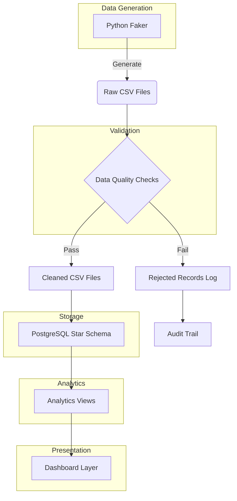

# Architecture

## Overview

The Care Operations Analytics platform follows a layered analytics architecture designed for consulting-grade deliverables. The system transforms raw synthetic data into production-ready analytics through a well-defined pipeline.

## Mermaid Architecture Diagram



## Layer-by-Layer Explanation

### Layer 1: Raw Data Generation

The `src/generate_data.py` module uses Faker configured for Canadian locale to produce seven realistic datasets:

- 300 clients across 25 Canadian cities
- 110 workers across 7 healthcare professional types
- 6 funders with varying funding types and limits
- ~7,500 service visits spanning 12 months
- ~7,000 claims linked to completed visits
- 300 reconciliation exceptions

All data is deterministic using a fixed random seed for reproducibility.

### Layer 2: Data Quality Validation

The `src/quality_checks.py` module implements reusable, composable validation rules:

- **Column completeness**: All required columns are present
- **Null detection**: Required fields are populated
- **Uniqueness**: Primary keys are unique
- **Date parsing**: Dates are valid and parseable
- **Non-negative constraints**: Monetary and hour values are valid
- **FK integrity**: All foreign keys reference valid records
- **Duplicate detection**: No duplicate records in any dataset
- **Business rules**: Completed hours don't exceed tolerance thresholds

Results are written to `data/processed/quality_report.csv`.

### Layer 3: Transformation and Cleaning

The `src/transform.py` module separates valid records from invalid ones:

- Each dataset has a dedicated cleaning function
- Invalid records are preserved in `_rejected.csv` files
- Full audit trail via `loading_summary.csv`
- No silent deletion of bad records

### Layer 4: PostgreSQL Star Schema

The `sql/01_create_schema.sql` defines the dimensional model:

- **4 dimension tables**: `dim_date`, `dim_client`, `dim_worker`, `dim_funder`, `dim_service`
- **4 fact tables**: `fact_service_visit`, `fact_claim`, `fact_reconciliation_exception`, `fact_funding_allocation`
- **Date keys** in YYYYMMDD integer format for efficient joins
- **Appropriate numeric types** for currency and hours
- **Indexes** for common joins and date filters
- **Foreign key constraints** for referential integrity

### Layer 5: Analytics Views

The `sql/02_analytics_views.sql` creates 8 dashboard-ready views:

| View | Purpose |
|------|---------|
| `vw_monthly_operations` | Monthly trend dashboard |
| `vw_funding_utilization` | Funding allocation vs spend |
| `vw_at_risk_funding` | 90%+ utilization alerts |
| `vw_claims_rejection_by_funder` | Rejection pattern analysis |
| `vw_aging_exceptions` | Exception aging and priority |
| `vw_worker_capacity_violations` | Capacity constraint monitoring |
| `vw_doc_delay_analysis` | Documentation delay impact |
| `vw_duplicate_claim_risk` | Duplicate claim exposure |

### Layer 6: Dashboard Layer

The views and SQL queries in `sql/03_analysis_queries.sql` provide direct answers to business questions:

1. Monthly operational KPIs
2. Funding utilization and risk
3. Claims rejection patterns
4. Aging exceptions by priority
5. Worker capacity constraints
6. Documentation delay trends
7. Duplicate claim financial exposure

## Data Flow Summary

```
Faker (Python) → CSV (Raw) → Quality Checks → CSV (Cleaned) → SQLAlchemy → PostgreSQL (Star Schema) → Views → Dashboard
```

Each layer is independently testable and can be re-run without affecting upstream or downstream components.

## Database Design Choices

- **Star schema over snowflake**: Simpler queries, better performance for reporting, easier for dashboard consumers
- **Integer date keys**: Faster joins than string dates, easy filtering
- **Separate service dimension**: Enables cross-fact analysis of service types
- **Comprehensive indexing**: Supports the most common query patterns (date filters, FK joins, status filters)
- **ON CONFLICT DO UPDATE**: Idempotent loading ensures safe re-runs
